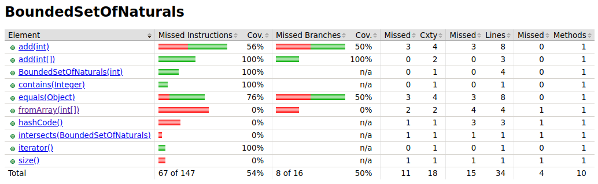
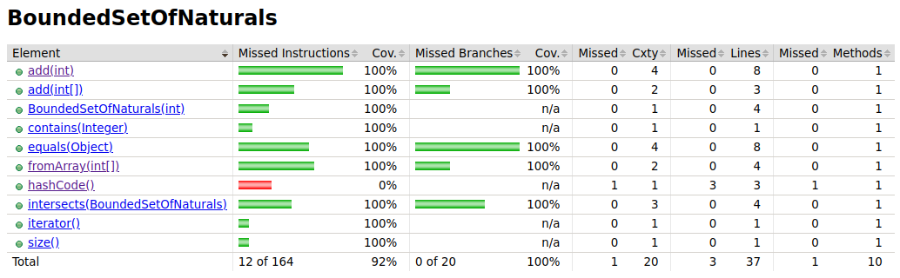

# Lab 1 - notebook

## Lab 1.1

## Lab 1.2

### 2.c)
_Analyze the results accordingly. Which classes/methods offer less coverage? Are all possible [decision] branches being covered?_
- 

According to the results of the coverage for **BoundedSetOfNaturals**, some methods are not being tested 100%, so I consider that it's necessary add more tests for the following functions:
* add(int) 
* equals(Object)
* fromArray(int[])
* intersects(BoundedSetOfNaturals)
* size() 

In my opinion it's irrelevant create test to test _hashcode()_

As seen in the next image, all the methods previously mentioned are now being tested 100% 

