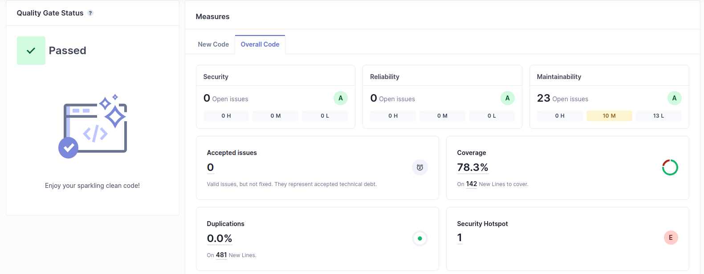

# Lab 6 - notebook

## Lab 6.1

### Prepare a local instance of SonarQube
```bash
docker run -d --name sonarqube -e SONAR_ES_BOOTSTRAP_CHECKS_DISABLE=true -p 9000:9000 sonarqube:latest
```

The Sonar Dashboard is available at [http://localhost:9000](http://localhost:9000)

generated token: `euromillions-tqs`
password: `tqs2024`

From the command line, run the code analysis:
```bash
mvn verify sonar:sonar -Dsonar.host.url=http://localhost:9000 -Dsonar.projectKey=euromillions-tqs -Dsonar.login=admin -Dsonar.password=tqs2024
```

### SonarQube Dashboard


As seen, in the previous image, the project passed the defined quality gated passed, however, it shows 23 issues, that could take 1h21min to resolve them


### SonarQube Quality Gate
| Issue | Problem description | How to solve |
| ----- | ------------------- | ------------ |
| Invoke method(s) only conditionally. | passing concatenated strings into a logging method can incur a needless performance hit because the concatenation will be performed every time the method is called  | conditionally invoke the logging method only when necessary |
| Refactor the code in order to not assign to this loop counter from within the loop body. | the loop counter against an invariant value that does not change during the execution of the loop. | Add the loop counter.
| This block of commented-out lines of code should be removed. | Commented-out code distracts the focus from the actual executed code | Commented-out code should be deleted


## Lab 6.2

## Lab 6.3