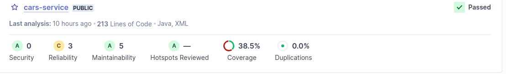

# Lab 6 - notebook

## Lab 6.1

### Prepare a local instance of SonarQube
```bash
docker run -d --name sonarqube -e SONAR_ES_BOOTSTRAP_CHECKS_DISABLE=true -p 9000:9000 sonarqube:latest
```

The Sonar Dashboard is available at [http://localhost:9000](http://localhost:9000)

generated token: `euromillions-tqs`
password: `tqs2024`

From the command line, run the code analysis:
```bash
mvn verify sonar:sonar -Dsonar.host.url=http://localhost:9000 -Dsonar.projectKey=euromillions-tqs -Dsonar.login=admin -Dsonar.password=tqs2024
```

### SonarQube Dashboard


As seen, in the previous image, the project passed the defined quality gated passed, however, it shows 23 issues, that could take 1h21min to resolve them


### SonarQube Quality Gate
| Issue | Problem description | How to solve |
| ----- | ------------------- | ------------ |
| Invoke method(s) only conditionally. | passing concatenated strings into a logging method can incur a needless performance hit because the concatenation will be performed every time the method is called  | conditionally invoke the logging method only when necessary |
| Refactor the code in order to not assign to this loop counter from within the loop body. | the loop counter against an invariant value that does not change during the execution of the loop. | Add the loop counter.
| This block of commented-out lines of code should be removed. | Commented-out code distracts the focus from the actual executed code | Commented-out code should be deleted


## Lab 6.2

### Preparing the analysis
In SonarQube, it was created a new project for analysing the cars project from lab3
Then, in the command line:
```bash
mvn verify sonar:sonar -Dsonar.host.url=http://localhost:9000 -Dsonar.projectKey=cars-service -Dsonar.login=admin -Dsonar.password=tqs2024
```

Just like in the exercise 3, it was needed to start a mysql instance, in order to the integration tests run
```bash
docker run --name mysql5tqs -e MYSQL_ROOT_PASSWORD=password -e MYSQL_DATABASE=tqsdemo -e MYSQL_USER=demo -e MYSQL_PASSWORD=demo -p 33060:3306 -d mysql/mysql-server:5.7
```

Futhermore, it was also needed to add jacoco and sonar plugins to the pom, in order to the analyse cover these tests
```xml
<plugin>
    <groupId>org.sonarsource.scanner.maven</groupId>
    <artifactId>sonar-maven-plugin</artifactId>
    <version>3.7.0.1746</version>
</plugin>
<plugin>
    <groupId>org.jacoco</groupId>
    <artifactId>jacoco-maven-plugin</artifactId>
    <version>0.8.8</version>
    <executions>
        <execution>
            <goals>
                <goal>prepare-agent</goal>
            </goals>
        </execution>
        <execution>
            <id>report</id>
            <phase>prepare-package</phase>
            <goals>
                <goal>report</goal>
            </goals>
        </execution>
    </executions>
</plugin>
```

### Analysis

As seen in the previous screenshot, the project had some reliabilty and maintainability issues, including 3 medium issues


#### Remove field injection and use constructor injection instead

In this case, it was needed to refactor the `@Autowired` structure, creating a constructor that accepts an instance of `CarRepository`
```java
private final CarManagerService carManagerService;

@Autowired
public CarController(CarManagerService carManagerService) {
    this.carManagerService = carManagerService;
}
```

#### Bind path variable "id"

To solve this issue, it was just needed to add `("id")` to the `@PathVariable`

#### Remove field injection and use constructor injection instead

The last issue was similar to the first one related to the class `CarController`, but this was about `CarManagerService`. So this was solved:
```java
private final CarRepository carRepository;

@Autowired
public CarManagerService(CarRepository carRepository) {
    this.carRepository = carRepository;
}
```

### Final Analysis
After solving the issues, there were only 3 level low maintainability issues and the tests covered was 42%


